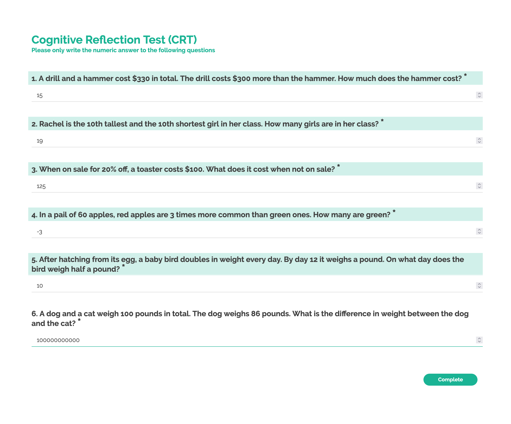

# Cognitive Reflection Test

## Survey Purpose
The Cognitive Reflection Test (CRT) is a 3-item measure of cognitive ability that is correlated with the ability to detect and resist cognitive biases. It is a short measure of cognitive ability that is correlated with the ability to detect and resist cognitive biases. It is a short measure of cognitive ability that is correlated with the ability to detect and resist cognitive biases. It is a short measure of cognitive ability that is correlated with the ability to detect and resist cognitive biases. It is a short measure of cognitive ability that is correlated with the ability to detect and resist cognitive biases. It is a short measure of cognitive ability that is correlated with the ability to detect and resist cognitive biases. It is a short measure of cognitive ability that is correlated with the ability to detect and resist cognitive biases.

## Theoretical construct

Per the original paper by Curhan et al. (2006), one's subjective feelings about negotiation involves 4 underlying subconstructs: (1) Feelings About the Instrumental Outcome, (2) Feelings About the Self, (3) Feelings About the Negotiation Process, and (4) Feelings About the Relationship.

# Adaptations

We stuck to the original survey from http://www.subjectivevalue.com/ as closely as possible. The only modification was that we shortened the lengths of some of the scale points.

### Screenshot

