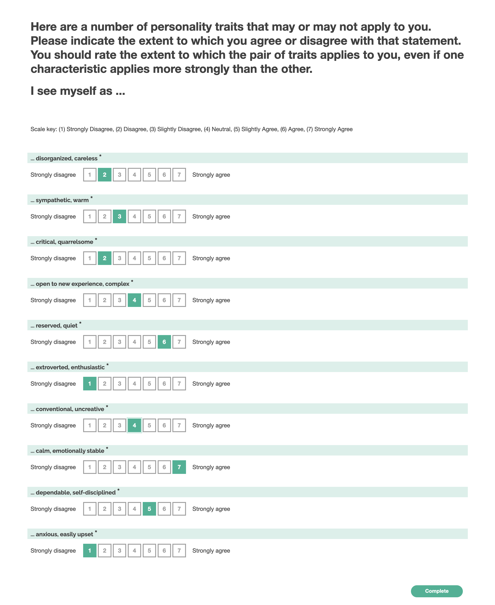

# Ten Item Personality Inventory

## Survey Purpose

This particular survey aims to use the Ten-Item Personality Inventory (TIPI) to quantify the particpant's Big-Five personality dimensions.

## Theoretical construct

The Big 5 personality inventory includes

- Extroversion
- Conscientiousness
- Agreeableness
- Openness to experience
- Emotional Stability / Neuroticism

Measuring these traits can be expensive, as the traditional big 5 tests have many questions. This scale takes a rough measure of these attributes, and was originally developed in:

> Gosling, Samuel D., Peter J. Rentfrow, and William B. Swann Jr. "A very brief measure of the Big-Five personality domains." Journal of Research in personality 37.6 (2003): 504-528.

> When time is limited, researchers may be faced with the choice of using an extremely brief measure of the Big-Five personality dimensions or using no measure at all. To meet the need for a very brief measure, 5 and 10-item inventories were developed and evaluated. Although somewhat inferior to standard multi-item instruments, the instruments reached adequate levels in terms of: (a) convergence with widely used Big-Five measures in self, observer, and peer reports, (b) test–retest reliability, (c) patterns of predicted external correlates, and (d) convergence between self and observer ratings. On the basis of these tests, a 10-item measure of the Big-Five dimensions is offered for situations where very short measures are needed, personality is not the primary topic of interest, or researchers can tolerate the somewhat diminished psychometric properties associated with very brief measures.

# Adaptations

The original survey asked people to fill in a number in a blank. Here we provide a range of numerical values.

### Screenshot

