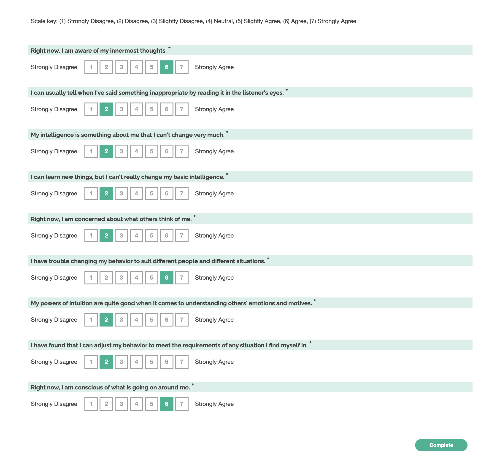

# Awareness, Monitoring, Growth

## Theoretical construct

Tests three psychometric constructs:

- Self awareness
- Self monitoring
- Growth mindset

### Adaptations from the original survey instruments:

#### Situational Self-awareness

Taken from:

> Govern, J. M., and L. A. Marsch. 2001. “Development and Validation of the Situational Self-Awareness Scale.” Consciousness and Cognition 10 (3): 366–78.

The original survey included 9 items:

|     | Item                                                           | Primary factor | Loading 1 | Loading 2 |
| --: | :------------------------------------------------------------- | :------------: | --------: | --------: |
|  1. | Right now, I am keenly aware of everything in my environment.  |  Surroundings  |       .59 |       .81 |
|  2. | Right now, I am conscious of my inner feelings.                |    Private     |       .75 |       .68 |
|  3. | Right now, I am concerned about the way I present myself.      |     Public     |       .73 |       .80 |
|  4. | Right now, I am self-conscious about the way I look.           |     Public     |       .71 |       .88 |
|  5. | Right now, I am conscious of what is going on around me.       |  Surroundings  |       .68 |       .75 |
|  6. | Right now, I am reflective about my life.                      |    Private     |       .71 |       .76 |
|  7. | Right now, I am concerned about what other people think of me. |     Public     |       .73 |       .85 |
|  8. | Right now, I am aware of my innermost thoughts.                |    Private     |       .76 |       .84 |
|  9. | Right now, I am conscious of all objects around me.            |  Surroundings  |       .79 |       .78 |

We have taken one from each group (Private: 8, Public: 7, Surroundings: 5).

#### Self-monitoring

Taken from:

> Lennox, R. D., and R. N. Wolfe. 1984. “Revision of the Self-Monitoring Scale.” Journal of Personality and Social Psychology 46 (6): 1349–64.

The original instrument had many items, divided into several categories. We have taken the following:

- Ability to modify self-presentation:

  - _"I have found that I can adjust my behavior to meet the requirements of any situation I find myself in."_
  - _"I have trouble changing my behavior to suit different people and different situations."_

- Sensitivity to expressive Behavior of others:
  - _"My powers of intuition are quite good when it comes to understanding others' emotions and motives."_
  - _"I can usually tell when I've said something inappropriate by reading it in the listener's eyes."_

#### Growth mindset

Taken from:

> Dweck, Carol S., Chi-Yue Chiu, and Ying-Yi Hong. 1995. “Implicit Theories and Their Role in Judgments and Reactions: A World from Two Perspectives.” Psychological Inquiry 6 (4): 267–85.

The original scale had three items:

1. I have a certain amount of intelligence, and I can’t really do much to change it.
2. My intelligence is something about me that I can’t change very much.
3. I can learn new things, but I can’t really change my basic intelligence.

In this adaptation, we've taken questions 2 and 3 only, to shorten the survey. All of the original questions have about the same factor loadings (.91-.96) so we chose these because they were easier to read.

### Screenshot

