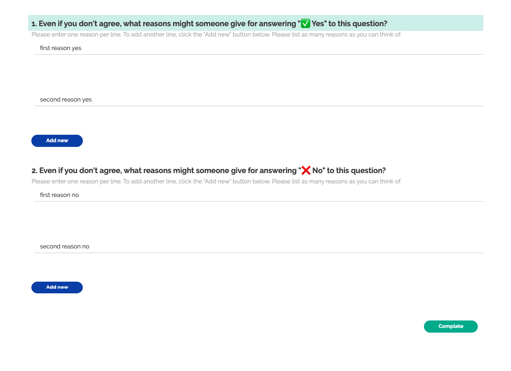

# Awareness of Arguments (Yes/No)

## Theoretical construct

Awareness of rationales for oppositional views has been posited as a general product of political exchanges that involve disagreement (Mutz, Diana C., and Jeffery J. Mondak. 2006. “The Workplace as a Context for Cross-Cutting Political Discourse.” The Journal of Politics 68 (1): 140–55.)

## Examples in the literature:

> "...open-ended questions were used to solicit issue-specific rationales for three separate controversies. ... Respondents were asked what reasons they could think of for each of the various view-points (“Regardless of your own views, what reasons can you think of for ...?”). The order in which own and opposing view questions appeared was randomized to prevent potential order effects. The open-ended responses were later coded into individual rationales by two independent coders. Volunteered rationales for own and opposing views were not evaluated by any external standards of sophistication. But coders did eliminate from the counts the rationales that served to delegitimize the other viewpoint. For example, if a respondent explained why others supported Bill Clinton with reference to negative personal traits of the opinion holder (“Other people might vote for him because they are stupid”) or negative traits of Clinton (“He’s so slippery and slick and a good puppet”), then these were not counted as acknowledgments of a legitimate basis for the oppositional viewpoint. (Mutz, Diana C. 2006. Hearing the Other Side: Deliberative versus Participatory Democracy. Cambridge, England: Cambridge University Press.)

> "An ongoing element of NES survey content has been the respondents’ reported lists of likes and dislikes regarding the presidential candidates—the reasons for their candidate attitudes. In the open-ended formats of these questions, interviewers first ask the respondents what they like and then what they dislike about each of the major candidates.... Actual question wording: “Is there anything in particular about (candidate name) that might make you want to vote for him?” and “Is there anything in particular about (candidate name) that might make you want to vote against him?” (Huckfeldt, Robert, Jeanette Morehouse Mendez, and Tracy Osborn. 2004. “Disagreement, Ambivalence, and Engagement: The Political Consequences of Heterogeneous Networks.” Political Psychology 25 (1): 65–95.)

> "Is there anything in particular about [preload: DEM_PCNAME] that might
> make you want to vote for him?" (yes/no/refuse/dont know), followed by "What is that?" (American National Election Studies. 2015. “User’s Guide and Codebook for the ANES 2012 Time Series Study.” The University of Michigan and Stanford University.)

## Design choices

### Yes/No Framing

The question/topic/issue might be framed in several different ways that these survey items

- "yes" and "no"
- "agree with you", and "disagree with you"
- agree/disagree with a statement we provide
- reasons why (statement we provide)

In this case, we frame it for yes/no questions. We may develop another survey later on that frames the question differently.

### Regardless of your own views

It also seems important to say something like "regardless of your own views". Want to imply that this is not to denigrate your own opinion (as could be done subtly by "Disregarding your own viewpoint"). Also don't want to imply that they should not include their own justifications if they are relevant ("Setting aside your own views"). Also want the sentence to be clear and easy to read, not requiring a lot of parsing of negatives...

- "Regardless of your own views, ..."
- "Setting aside your own views, ..."
- "Putting aside your own perspective, ..."
- "Regardless of where you stand, ..."
- "Setting aside your own opinion, ..."
- "People have opinions on both sides of this question."
- "Even if you disagree, ..."
- "Even if you don't agree, ..."
- "Whether you agree or disagree, ...
- "Whether or not you agree, ...

### What reasons are there vs what reasons might someone give

Is the question trying to get the participant to see both sides of an issue, or to get into the head of someone who disagrees with them? A very subtle difference. If we ask the participant for reasons in support of the opposing argument directly, they may choose not to list items that other people claim as reasons but they personally discount. This would undersample awareness of oppositional arguments.

Want to make it clear that we're looking for reasons a person might give to justify their answer, not reasons that would justify (in the respondents' eyes) someone who answers a certain way. (i.e. we don't want respondents to filter for only reasons they agree with.) Also want to discourage responses such as "because they are an idiot", which you might get with questions phrased as "Why would someone say `yes`..."

- ... what reasons support a `yes` answer?
- ... why would someone say `yes`?
- ... what reasons might someone give for answering `yes`?

### Randomizing order

It is possible that there will be some fatigue effects, such that people are more likely to give more reasons for whatever comes first (or alternately, some "warmup" effects, in that they realize answers to the second question while answering the first, and so report more in the second.) To guard against this, randomize the order we ask the questions.

### Single vs multiple pages

Ideally, we could randomize the order of questions between pages, and have each question display one at a time. Unfortunately [we can't randomize page order at the moment](https://surveyjs.answerdesk.io/ticket/details/t7419/random-pages-order), so chose randomization as a priority over separate display.

In the future, we should [build a function to randomize the order of pages](https://github.com/Watts-Lab/surveys/issues/171)

### "Add a box" vs. fixed large number of boxes vs single input box

Having multiple entry boxes makes it easier to count the number of responses people think they are giving (still possible that we might consider some to be repeats). This leans us away from having people list their reasons all in the same text box. However, if we have a whole list of boxes, we implicitly anchor people on a number of responses they should provide. This could be good or it could be bad, not sure.

Instead, we can give one box, plus an option for people to add an additional input box. This has a bit of risk that people won't understand the interface, so if we see a whole lot of `length === 1` response lists, we should revisit this choice.

### Attention devices

We want to make sure people can quickly see the difference between the two (very similar) questions. One way to do this is to simulate the radio button that people used to answer the question, and signal "yes"ness and "no"ness also with the color and shape of the radio button.

- "✅ Yes"
- "❌ No"
- 👍
- 👎
- ⛔️
- ☑️

Leaning towards ✅ and ❌, as these are primarily english speaking western participants, although this may create some disfluency for people from other cultures.

## Operationalization

- "Even if you don't agree, what reasons might someone give for answering '✅ Yes' to this question?"

## Usage

This survey is intended to be paired with a specific discussion topic, probably on the same page as something like:

> ## Consider the following topic:
>
> "Is cheerleading a sport?"
> (survey goes here)
