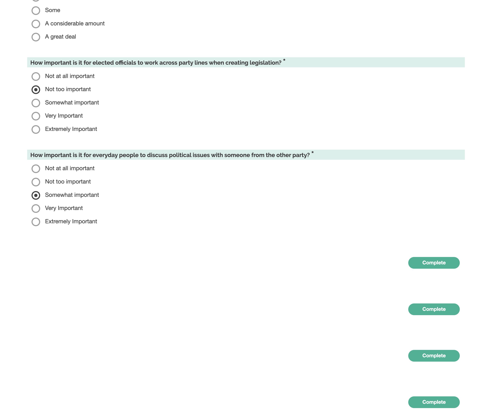

# Bipartisanship in the US

This survey measures US participants' support for bipartisanship along several dimensions.

The order of questions is randomized.

## Everyday cross-partisan conversations

> "we asked about the importance of cross-partisan dialogue, in particular, asking individuals three items about how important they thought it was for members of their party to engage in conversation with outparty members (e.g., “Talk to people who vote for [OUTPARTY] about politics.”). We categorize these outcomes as relevant to democratic accountability because conversations between citizens are thought to help limit elite influence and organize collective action [e.g., (47)]. To measure the importance of cross-partisan dialogue, we created an additive index of multiple items that only appeared in the follow-up survey"
>
> In your opinion, how important is it for people who vote for <inparty> to... (a) talk to people who vote for <outparty> about politics (b) talk to people who vote for <outparty> about the political issues that matter to <outparty> (c) talk to people who vote for <outparty> about the political issues that matter to <inparty>? [Not at all important / Slightly Important / Moderately Important / Very Important / Extremely Important]
> (Santoro, Erik, and David E. Broockman. 2022. “The Promise and Pitfalls of Cross-Partisan Conversations for Reducing Affective Polarization: Evidence from Randomized Experiments.” Science Advances 8 (25): eabn5515.)"

> "It's important to understand Americans with other political views by imagining how things look from their perspective." (Kamin, Julia. 2022. “Social Cohesion Impact Measurement (SCIM) Framework Overview.” Civic Health Project. https://docs.google.com/document/d/1_nsLJNgWZVaNSq71PFpAHx7YM488FvTPIPFYWsytwus.) (not super connected)

### Operationalization

`How important is it for everyday people to discuss political issues with someone from the other party? [Not at all important / Not too important / Somewhat important / Very important / Extremely important]`

## Politicians working across the aisle

> """(i) To what extent would you like to see Democratic and Republican elected representatives work together? (ii) To what extent would you like the Democratic and Republican parties to cooperate more,
> even if it means compromising on issues you care about? (101-point scale from “Not at all” to “A great deal”) (Jan G. Voelkel, Michael N. Stagnaro, James Chu, Sophia Pink, Joseph S. Mernyk, Chrystal Redekopp, Matthew Cashman, James N. Druckman, David G. Rand, and Robb Willer. 2021. “Megastudy Identifying Successful Interventions to Strengthen Americans’ Democratic Attitudes.”)"

> "How important to you is it that [ingroup] elected officials make compromises with [outgroup] elected officialsto solve important problems?" (Kamin, Julia. 2022. “Social Cohesion Impact Measurement (SCIM) Framework Overview.” Civic Health Project. https://docs.google.com/document/d/1_nsLJNgWZVaNSq71PFpAHx7YM488FvTPIPFYWsytwus.)

### Operationalization

`How important is it for elected officials to work across party lines to create effective legislation?`

## Common ground between parties

> "perceptions of bipartisanship amongst partisans was: "How frequently do you think that the political goals of citizens that identify as Democrats and those that identify as Republicans are compatible? Goals are compatible when taking a step forward for one does not require a step back for the other." Response options were on a five point scale from Never (1) to Always (5)." (Rossiter, Erin. 2023. “The Similar and Distinct Effects of Political and Non-Political Conversation on Affective Polarization.”)

> "To what extent should Democrats and Republicans see themselves as united against a common enemy?" 101-point scale from “Not at all” to “A moderate amount” to “A great deal” (Jan G. Voelkel, Michael N. Stagnaro, James Chu, Sophia Pink, Joseph S. Mernyk, Chrystal Redekopp, Matthew Cashman, James N. Druckman, David G. Rand, and Robb Willer. 2021. “Megastudy Identifying Successful Interventions to Strengthen Americans’ Democratic Attitudes.”)

### operationalization

`How much opportunity is there for Republicans and Democrats to create policies they can both support?`
