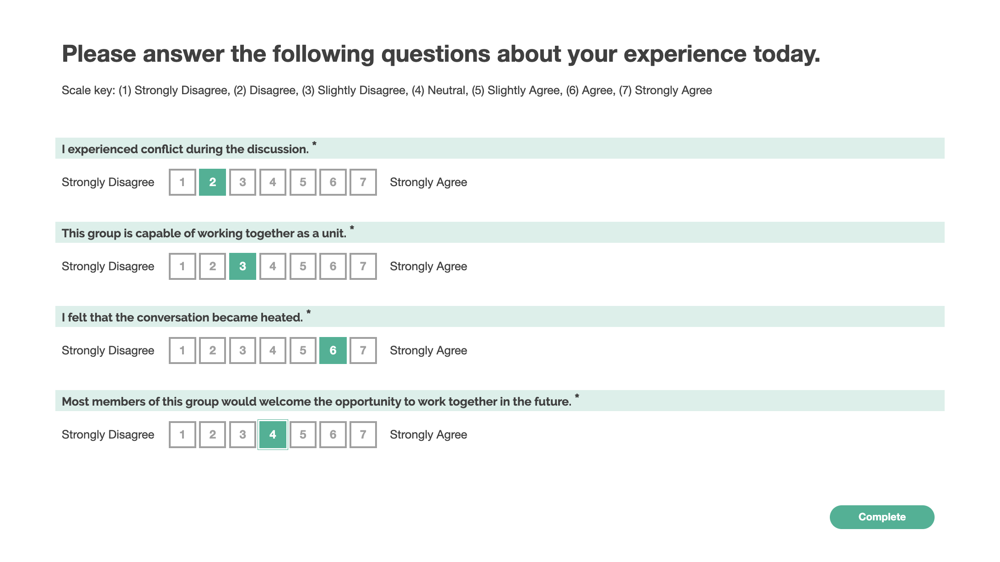

# Conflict and Team Viability

## Theoretical construct

This battery of short instruments is adapted from a number of sources, and addresses perceptions of conflict within the group and the group's long-term viability.

### Screenshot

