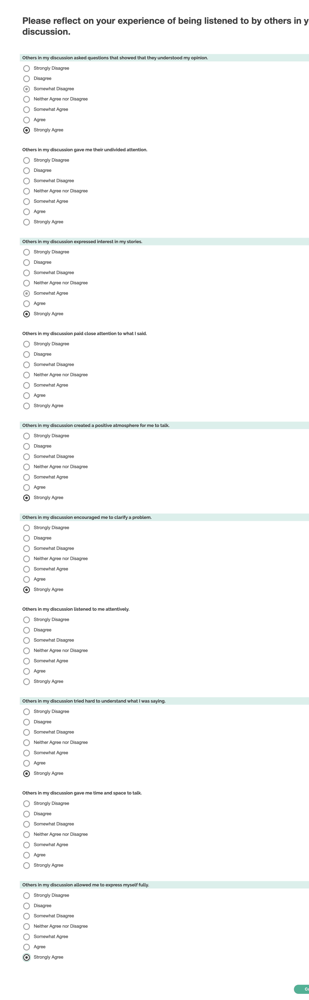

# Survey Purpose

This survey implements the "Constructive Listening Behaviors" portion of the Facilitating Listening Scale.

> The Facilitating Listening Scale (FLS) assesses speaker perceptions of the listening behaviors of their interlocutors and the consequences of these behaviors for the speakers.

(All text quotations from Kluger and Bouskila-Yam, 2017, unless noted otherwise)

This particular survey allows us to take a measure of a participant's subjective experience of working with the other perticipants throughout a given experiment. In this implementation **this survey records how well a participant felt they listened to by others in their conversation**.

Original citations for the survey come from:

> Bouskila‐Yam, O., & Kluger, A. N. (2011, December). The Facilitating Listening Scale (FLS). In A. N. Kluger (Chair), Listening, a symposium presented at the 1st Israel Organizational Behavior Conference, Tel Aviv, Israel.

Reproduced in

> Kluger, Avraham N., and Osnat Bouskila-Yam. 2017. “Facilitating Listening Scale (FLS).” In The Sourcebook of Listening Research, 272–80. Hoboken, NJ, USA: John Wiley & Sons, Inc.

### About the survey

> The FLS is a self‐administered questionnaire that takes about 10 minutes to complete. Respondents complete the FLS with respect to a particular target (e.g., one’s supervisor) and are invited to consider “your experience of being listened to by your \_\_\_\_,” where the blank could be any type of target, like a supervisor or partner.

### Original items

The original survey reported in the Sourcebook contains 38 listening behavior items broken into 7 categories, and 12 listeing outcome items in two categories.

> For each item, we want you to reflect on your experience of being listened to by your supervisor. For each item, indicate your level of agreement/disagreement using the following scale:
>
> - 1 = Strongly Disagree
> - 2 = Disagree
> - 3 = Somewhat Disagree
> - 4 = Neither Agree nor Disagree
> - 5 = Somewhat Agree
> - 6 = Agree
> - 7 = Strongly Agree
>
> The following items measure perceptions of listening behaviors and should be introduced by the prompt, “When my current supervisor listens to me, most of the time, s/he...”
>
> ### Constructive listening behaviors
>
> 1. Tries hard to understand what I am saying
> 2. Asks questions that show his/her understanding of my opinions
> 3. Encourages me to clarify a problem
> 4. Expresses interest in my stories
> 5. Listens to me attentively
> 6. Pays close attention to what I say
> 7. Gives me time and space to talk
> 8. Gives me his/her undivided attention
> 9. Creates a positive atmosphere for me to talk 10) Allows me to express myself fully
>
> ### Destructive listening behaviors
>
> 11. Talks offensively
> 12. Criticizes my feelings
> 13. Frowns (showing disapproving facial expressions)
> 14. Discounts or explains away my feelings
> 15. Is not willing to listen to me
> 16. Does not pay attention to things I say
> 17. Talks back to me aggressively
> 18. Becomes irritated
> 19. Is impatient
> 20. Gets tense
>
> ### Constructive listening behaviors – reframing
>
> 21. Restates what I say
> 22. Gives me a brief summary of what I have said
> 23. Completes my sentences to help me clarify what I am saying
> 24. Asks continuing questions like “Could you tell me more?”
>
> ### Destructive listening behaviors – domineering
>
> 25. Often interrupts me while I am talking
> 26. Begins to talk before I finish talking
> 27. Talks more than me
> 28. Imposes his/her own views
> 29. Listens to me calmly (reverse scored)
> 30. Hurries me into talking faster
>
> ### Destructive listening behaviors – escaping
>
> 31. Stares at the computer screen while I’m talking to him/her
> 32. Uses the telephone while I’m talking to him/her
> 33. Is distracted while I’m talking
>
> ### Destructive listening behaviors – no time
>
> 34. Begins a discussion by telling me how long s/he has for me
> 35. Looks at his/her watch or clocks in the room when s/he has limited time to listen to me
> 36. Hurries me and lets me know that s/he has a limited amount of time to listen
>
> ### Destructive listening behaviors – changing the subject
>
> 37. Starts talking about unrelated issues
> 38. Changes the subject too frequently

# Design and modifications

This survey implements the original scale portion as described.

### Scoring

> To obtain scores, items that constitute that subscale are averaged.

# Literature/Past Project Citations

Bouskila‐Yam, O., & Kluger, A. N. (2011, December). The Facilitating Listening Scale (FLS). In A. N. Kluger (Chair), Listening, a symposium presented at the 1st Israel Organizational Behavior Conference, Tel Aviv, Israel.

Permission is given by the source material:

> The FLS is provided free to use for research purposes with appropriate citation.

### Screenshot

