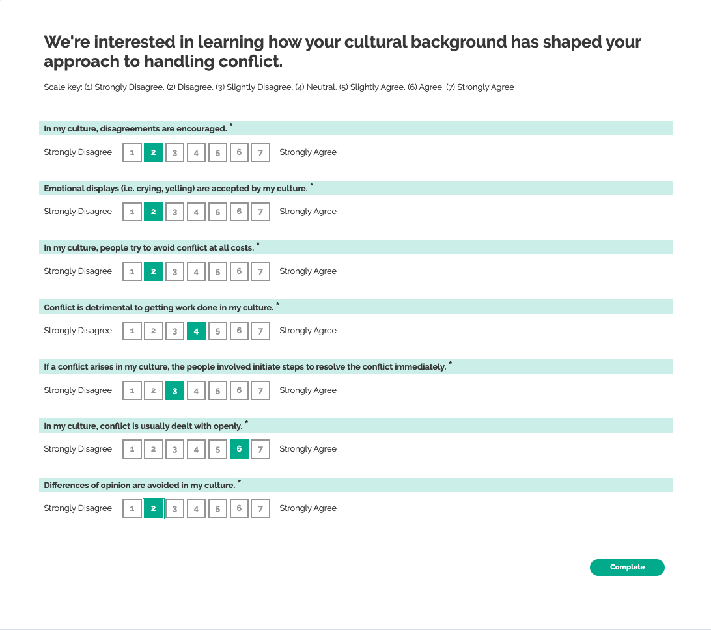

# Cultural Conflict Norms

A moderator for conflict in conversations has to do with how people are taught to surface or suppress conflict. Some cultures value avoiding conflict and others value raising it.

## Literature

> ### Conflict Norms
>
> 1. Conflict is dealt with openly in my work unit.
> 2. People in my work unit try to avoid conflict at all costs. (R)
> 3. If conflict arises in my work unit, the people involved initiate steps to resolve the conflict immediately. (R)
> 4. Conflict is detrimental to getting the work done in my work unit. (R)
> 5. Emotional displays (i.e., crying, yelling) are accepted in my work unit.
> 6. Disagreements are encouraged in my work unit.
> 7. Differences of opinions about job responsibilities are avoided in my work unit.(R)
>
> (R=reverse coded)
> (Jehn, Karen A. 1995. “A Multimethod Examination of the Benefits and Detriments of Intragroup Conflict.” Administrative Science Quarterly 40 (2): 256–82.)

> ### Relationship conflict norms:
>
> - Our group norms allowed us to argue about non-work things.
> - Fights about personal matters were allowed.
> - It is/was okay to fight about non-work things.
>
> ### Task conflict norms:
>
> - How comfortable did your team members feel questioning each others’ ideas?
> - We were open about task disagreements.
>
> ### Process conflict norms
>
> - Our norms allowed us to openly argue about process matters.
> - Disagreements about who should do what were encouraged.
>
> (Jehn, K. A., L. Greer, S. Levine, and G. Szulanski. 2008. “The Effects of Conflict Types, Dimensions, and Emergent States on Group Outcomes.” Group Decision and Negotiation. https://link.springer.com/article/10.1007/s10726-008-9107-0.)

## Design decisions

### "Culture" vs group norms

People are socialized both by their culture of origin and the culture of the environment in which conflict takes place. For example, the same person may surface conflict with their athletic team because doing so improves their performance, but suppress conflict at work because their boss is controlling.

### Repeating the context

We could pull "in my home culture" out of all the questions, but repeating it reminds participants of what we want them to consider when asking the question. We don't want them to consider their opinion of the world more generally, or their most recent discussion.

## Operationalization

We're interested in learning how your cultural background has shaped your approach to handling conflict.

Do you agree, disagree, or neither agree nor disagree with the following statements?

1. In my culture, conflict is usually dealt with openly.
2. In my culture, people try to avoid conflict at all costs. (R)
3. If a conflict arises in my culture, the people involved initiate steps to resolve the conflict immediately. (R)
4. Conflict is detrimental to getting work done in my culture. (R)
5. Emotional displays (i.e. crying, yelling) are accepted by my culture.
6. In my culture, disagreements are encouraged.
7. Differences of opinion are avoided in my culture. (R)

Higher values indicate norms towards openness towards conflict and acceptance of disagreement.
