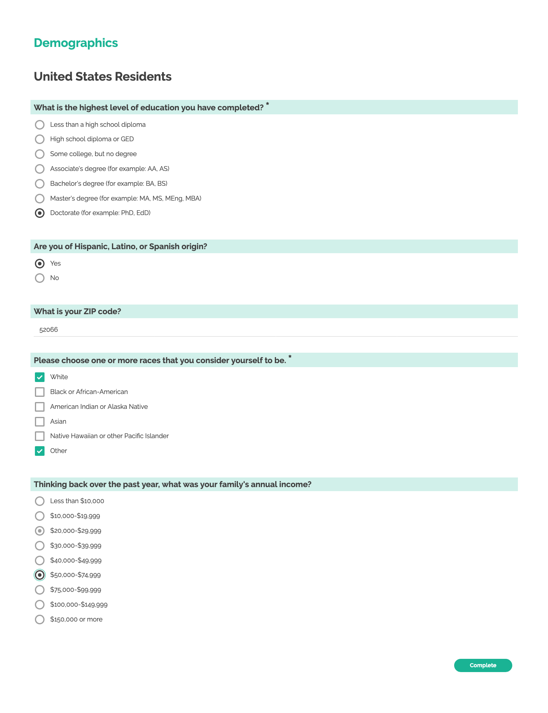

# Demographics Survey

## Survey purpose

Identify relatievly static attributes about an individual which are not likely to react to the stimulus in an experiment, but may be predictors of behavior.

The survey aims to ask questions that are appropriate to the respondent's home country, and so individuals resident in the US may (e.g.) see different survey questions than respondents from the UK.

### Screenshot

# Question Sources

This survey aggregates questions from a number of sources:

- Impairment https://analysisfunction.civilservice.gov.uk/policy-store/impairment/

Using the [International Standard Classification of Education](https://en.wikipedia.org/wiki/International_Standard_Classification_of_Education)

Mappings from [UNESCO](http://uis.unesco.org/en/isced-mappings)

# Salary Range

The salary values and ranges were scraped on December 19th 2024 from [salaryexplorer.com](https://www.salaryexplorer.com/), and then rounded and bucketed into (If possible) 8 buckets. The values are in local currency.

## United Kingdom:

#### Education

Some inspiriation from https://www.lse.ac.uk/media-and-communications/assets/documents/research/preparing-for-a-digital-future/Questionnaire.pdf

#### Ethnicity

Source: https://analysisfunction.civilservice.gov.uk/policy-store/ethnicity-harmonised-standard/#questions-for-england

## United states

Questions from ANES: https://electionstudies.org/wp-content/uploads/2020/07/anes_pilot_2020ets_qnnaire.pdf

