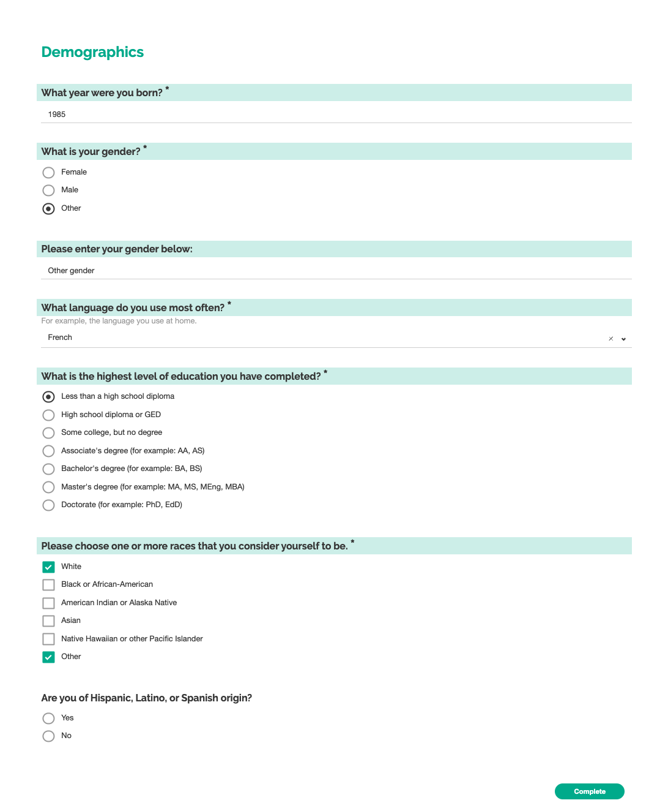

# Demographics Survey

## Survey purpose

Identify relatievly static attributes about an individual which are not likely to react to the stimulus in an experiment, but may be predictors of behavior.

A shortened demographic survey for US residents

### Screenshot

