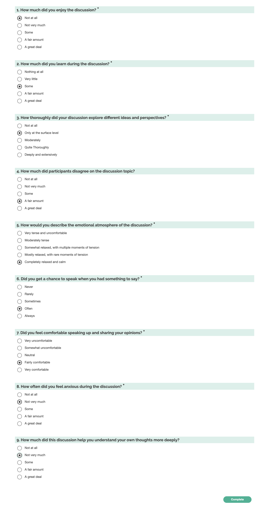

# General Discussion Itmes

### Screenshot

## Design notes

- We choose not to use "NA" / "No opinion" / "I haven't thought about this" answer options. [Krosnick et al 2002] argue that "inclusion of no-opinion options in attitude measures may not enhance data quality and instead may preclude measurement of some meaningful opinions", as does [Krosnick, Judd and Wittenbrink 2014] and [Boudreau and Lupia 2011]. The GSS is moving away from "Don't Know" style questions in favor of letting participants skip questions [Davern et al. 2024], although in their context skipping questions has more to do with preserving participant comfort and privacy.
- Some of these questions expect to see a saturation effect, as some of the things we care about are important when they go wrong, but usually go right. There are several biases that make saturation even more likely - a primacy effect when response choices are listed in order means that participants "tend to choose items at the top of the list", a "social desirability effect" which leads people to be more likely to respond with the more socially acceptable answer, and an acquiescence bias, which means that certain groups of people are more likely to choose "agree" regardless of their actual feelings [Pew Research Center 2021]. To deal with these interacting effects, we try to minimize use of agree/disagree scales, and to counterbalance the effect of social desirability (and saturation) by putting the more socially desirable answer at the bottom of the list.
- We also try to reduce the cognitive effort associated with answering the question. This should help us get better responses, as we'll have fewer people just randomly clicking or satisficing. Some ways to do this:
  - by shortening the questions and making them easy to read
  - by minimizing the amount of "translation" people have to do, ie, between their views an a numerical scale or agree/disagree scale
- The general order is your opinions of the alter, then your assessment of the alter's behavior.

## Measures

## Outputs:

### Responses:

### Result
