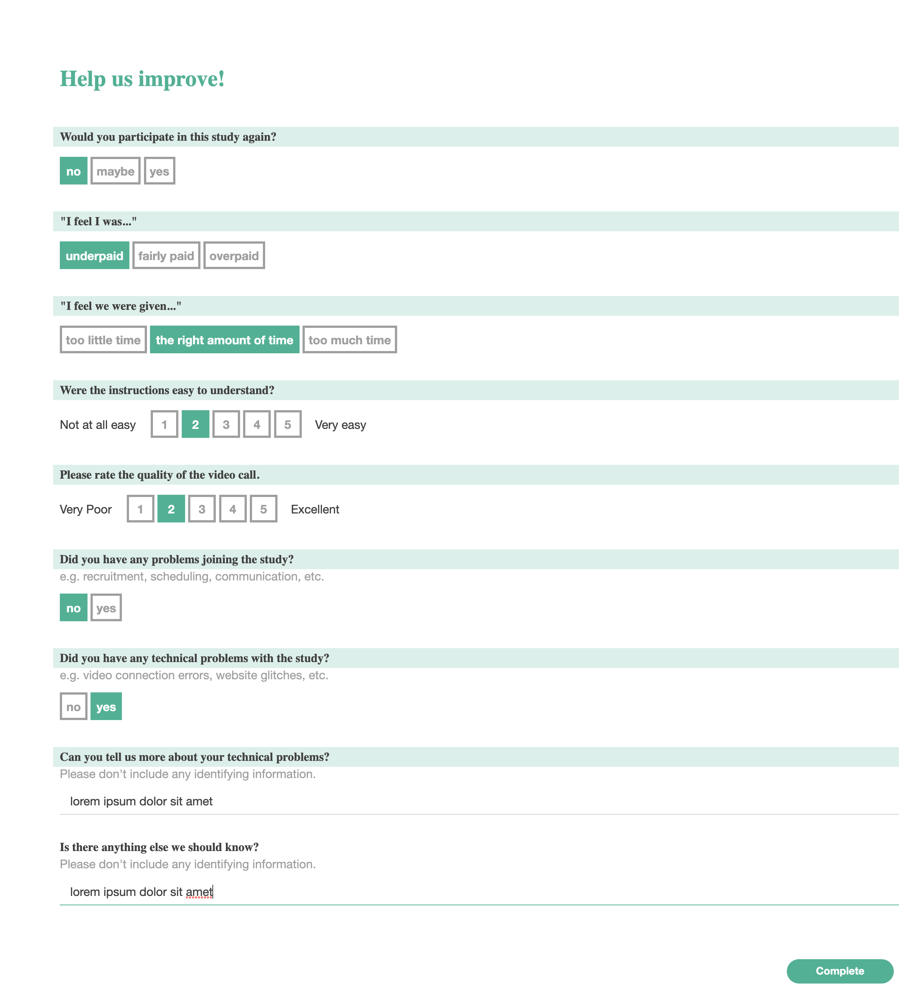

# Survey Purpose

The main purpose of this survey is to identify any problems with how we are running
the experiment, from both a technical and human perspective.

# Expected behavior

The survey is optional and will likely comes after payment has been fixed.

# Design Rationale

We decided to make the survey as simple and quick to complete as possible, while
still touching on the major places where things could go wrong in our experiment
and we want feedback. We have a single top-line question about whether people
would participate again, which we expect to serve as a general barometer.

# Edit History

Originally written Summer 2022 by Isaac Gateno, Kimberly Epstein and Skylar Rearik.
Updated October 2022 by James Houghton.

### Screenshot

