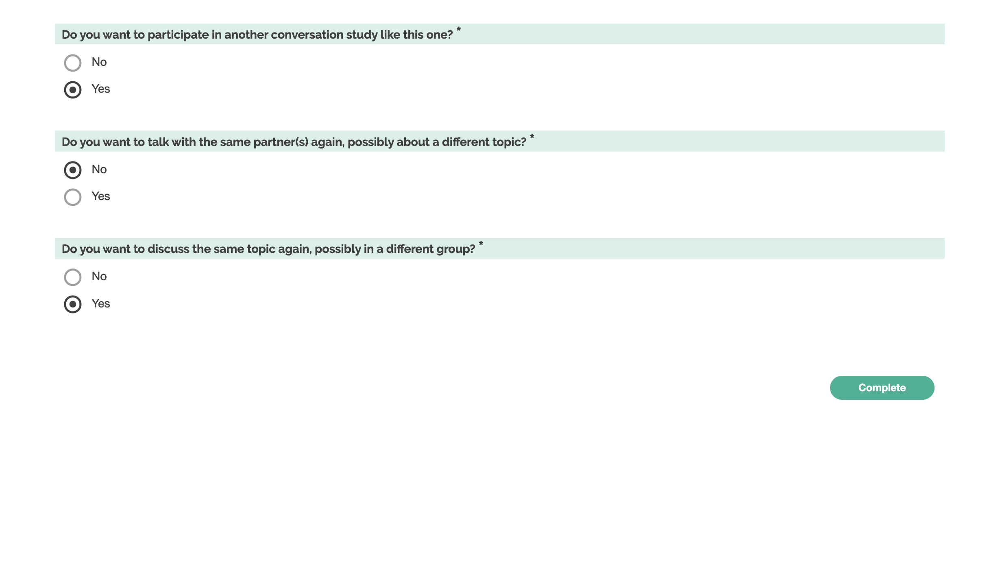

# Reengagement in discussion

This survey measures participants' willingness to reengage in a discussion, focussing on several attributes:

1. participating in future studies in general
2. future discussions with the same person
3. future discussions about the same topic

(The order of questions is not randomized)

We made a few design decisions to make sure we were measuring the right thing:

- We used yes/no responses rather than likert scale responses to make the question measure a behavior rather than an opinion. We phrase questions as "do you want to", to make them seem more like we are offering a choice, rather than making an inquiry (Are you interested in, would you be willing to (hypothetically...))

- We don't explicitly mention that the discussions will be "in the future" or "in another session", because the more we separate the choice from the future behavior, the less "behavioral" the result. However, we start with a question about participating in another study, which necessarily must be in the future. This implies, without increasing the salience, that the other two questions are also in the future.

- When we ask about discussions with a person, we want to get a value which is independent of their feelings about the topic, and vice versa. We emphasize that the conversation is "possibly about a different topic", etc. We want to make sure that we don't imply that they are committing to any particular topics ("regardless of the topic that is assigned"). We also want to make sure we don't imply that they will be able to choose the topic (e.g. "...about any topic"). We also don't want to imply that they are committing to talking about a different topic than the one they just discussed (e.g. "...about a different topic") because in the next question we ask them if they'd be willing to talk about the same topic, and we don't want the questions to interact.

## General willingness to participate in conversation studies

### Operationalization

`Do you want to participate in another conversation study like this one?`

## Willingness to reengage with particular discussion partner(s)

> "Would you like to have a conversation with this person again in the future? (Yes/No)" (Huang, Karen, Michael Yeomans, Alison Wood Brooks, Julia Minson, and Francesca Gino. 2017. “It Doesn’t Hurt to Ask: Question-Asking Increases Liking.” Journal of Personality and Social Psychology 113 (3): 430–52.)

> participants were asked about their willingness to talk politics again with their assigned conversation partner, asking agreement on a five point scale from strongly disagree (1) to strongly agree (5) for the statement "I would chat with my conversation partner about politics." (Rossiter, Erin. 2023. “The Similar and Distinct Effects of Political and Non-Political Conversation on Affective Polarization.”)

> "whether participants expressed a behavioral intention to engage with outparty. We measured this with three items: Participants were asked to indicate the extent to which they would be interested in having another conversation with a member of the outparty, if they would learn from such a conversation, and of the participants who indicated that they had a conversation, if they would be interested in meeting up with their partner again. We formed an index with all three items." (Santoro, Erik, and David E. Broockman. 2022. “The Promise and Pitfalls of Cross-Partisan Conversations for Reducing Affective Polarization: Evidence from Randomized Experiments.” Science Advances 8 (25): eabn5515.)

> Intent to remain in the team. We measured intent to remain with 3 items focused on members’ desire to stay in or leave the team (i.e., “If I could have left this team and worked with another team, I would have,” “I wouldn’t hesitate to participate on another task with the same team members,” and “If given the choice, I would prefer to work with another team rather than this one.”). Items were rated on a 5-point, Likert-type scale ranging from 1 (strongly dis-agree)to5(strongly agree). (Bayazit, Mahmut, and Elizabeth A. Mannix. 2003. “Should I Stay or Should I Go? Predicting Team Members’ Intent to Remain in the Team.” Small Group Research 34 (3): 290–321.)

> The specific questions used to measure satisfaction with membership and satisfaction with output were developed for this study. Satisfaction with membership was composed of three items: Being a member of this team has been personally satisfying, I would choose this team to work with on similar tasks in the future, and being a member of this team was a positive experience. Satisfaction with output was also composed of three items: I am satisfied with the final project of this team, we did an excellent job on our case analysis, and the team’s final paper is better than what I could have done on my own. (Bushe, Gervase R., and Graeme H. Coetzer. 2007. “Group Development and Team Effectiveness: Using Cognitive Representations to Measure Group Development and Predict Task Performance and Group Viability.” The Journal of Applied Behavioral Science; Arlington 43 (2): 184–94,196,198–202,204–12.)

### Operationalization

`Do you want to talk with the same partner(s) again, possibly about a different topic?`

## Willingness to reengage on particular discussion topic

> to assess willingness to have future political conversations, I asked about "immigration," as that was the political topic prompt. Specifically, participants were asked to indicate their agreement on a five point scale from strongly disagree (1) to strongly agree (5) for the following questions... "I am willing to have a conversation about immigration with a person that identifies as [Democrat/Republican]." (Rossiter, Erin. 2023. “The Similar and Distinct Effects of Political and Non-Political Conversation on Affective Polarization.”)

### Operationalization

`Do you want to discuss the same topic again, possibly in a different group?`
