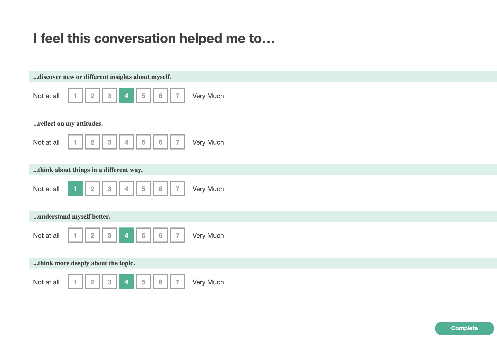

# Survey Purpose

This survey is designed to follow a discussion, and is designed to assess how well the conversation prompted introspection in the respondent about their own attitudes towards a topic.

From Itzchakov et al. (2020):

> attitude change may occur because high quality listening facilitates the insight needed to explore and integrate potentially threatening information re- levant to the self. By extension, self-insight may enable attitude change as a result

and

> Self-insight is defined as a deeper reflection and understanding about how one relates to the topic under discussion – and this downstream consequence is a primary goal of many psychotherapies seen to underlie behavioral and attitudinal change (e.g., Bennett-Levy & Thwaites, 2007; Connolly Gibbons et al., 2007). However, self-insight is important to differentiate from see- mingly similar constructs present in the literature. Insight has been studied at the dispositional level, though it is measured in terms of felt confusion about one's experiences alongside self-understanding (Grant et al., 2002). This formulation is sensible for dispositional measures where insight reflects a sense of clarity rather than disorder around the self (Campbell, Trapnell, Heine, Katz, Lavallee, & Lehman, 1996; Morrison & Wheeler, 2010), but less relevant when the insight relates to exploring currently held biases, where the absence of the previous self- reflection, rather than confusion, per se, is likely driving biases (Verplanken et al., 2007). Said another way, in the context of attitude change, self-insight matters insofar as it reflects a process of learning about oneself.

# Design and modifications

This implementation uses the survey almost verbatim from the source, pushing slightly more text to the topline, and adusting word usage from "reflect about your attitudes" to "reflect on your attitudes"

# Source literature

Itzchakov, Guy, Netta Weinstein, Nicole Legate, and Moty Amar. 2020. “Can High Quality Listening Predict Lower Speakers’ Prejudiced Attitudes?” Journal of Experimental Social Psychology 91 (November): 104022.

### Screenshot

