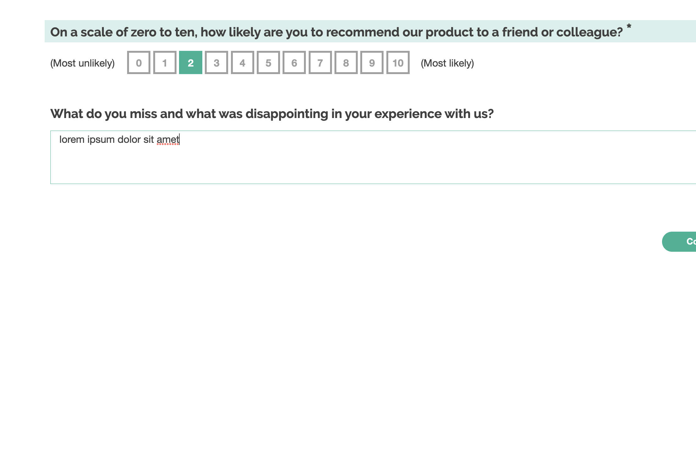

# Example Survey

This survey is included as a reference for how to include and document new surveys.
Surveys in the `/surveys` folder should be `.json` files containing the SurveyJS
json representation of your survey.

## Expected behavior

This survey asks about whether the respondent would recommend a product to a friend.
It then asks a follow-up question that is appropriate to their answer.

## Design and modifications

The survey was designed to demonstrate the use of SurveyJS, by the SurveyJS development team.
No modifications were made to the survey to include it in this library.

### Template data

The survey has no template placeholders, and so the template data is empty.

### Screenshot

