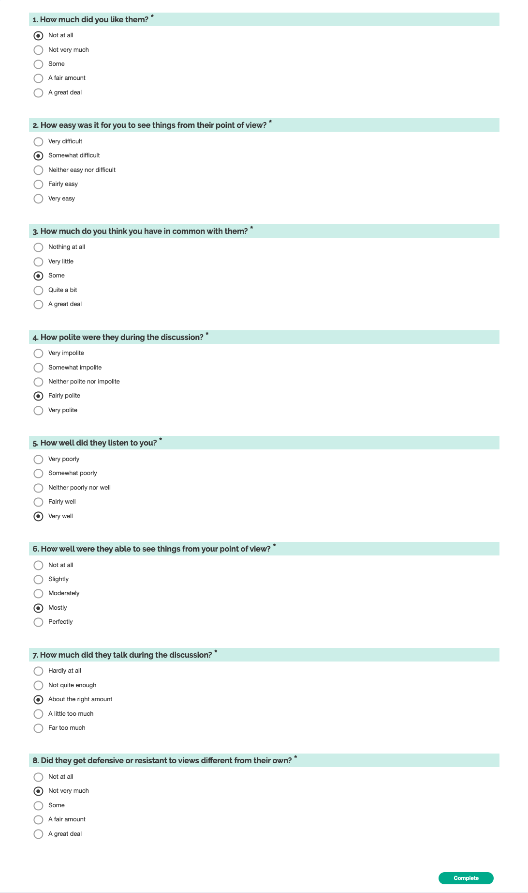

# Perceptions of Others

This survey asks about a generic other, "them/they", and could apply either to a specific individual alter, or the group as a whole. It should be preceded with a statement directing the respondent what person(s) they should keep in mind when answering the questions. For example:

> We would now like to ask some questions about (the other people in your group / your conversation partner / the person you were negotiating with / the provost / the person you found it most difficult to get along with.)

### Screenshot

## Design notes

- We choose not to use "NA" / "No opinion" / "I haven't thought about this" answer options. [Krosnick et al 2002] argue that "inclusion of no-opinion options in attitude measures may not enhance data quality and instead may preclude measurement of some meaningful opinions", as does [Krosnick, Judd and Wittenbrink 2014] and [Boudreau and Lupia 2011]. The GSS is moving away from "Don't Know" style questions in favor of letting participants skip questions [Davern et al. 2024], although in their context skipping questions has more to do with preserving participant comfort and privacy.
- Some of these questions expect to see a saturation effect, as some of the things we care about are important when they go wrong, but usually go right. There are several biases that make saturation even more likely - a primacy effect when response choices are listed in order means that participants "tend to choose items at the top of the list", a "social desirability effect" which leads people to be more likely to respond with the more socially acceptable answer, and an acquiescence bias, which means that certain groups of people are more likely to choose "agree" regardless of their actual feelings [Pew Research Center 2021]. To deal with these interacting effects, we try to minimize use of agree/disagree scales, and to counterbalance the effect of social desirability (and saturation) by putting the more socially desirable answer at the bottom of the list.
- We also try to reduce the cognitive effort associated with answering the question. This should help us get better responses, as we'll have fewer people just randomly clicking or satisficing. Some ways to do this:
  - by shortening the questions and making them easy to read
  - by minimizing the amount of "translation" people have to do, ie, between their views an a numerical scale or agree/disagree scale
- The general order is your opinions of the alter, then your assessment of the alter's behavior.

## Measures

### Liking

This type of question needs to go near the top, so that we don't change people's responses by having them reflect on how much the other person listened, etc.

#### Literature examples:

> Aggregation of: (1) My partner is likeable. (2) I liked my partner. (3) I would enjoy spending time with my partner. (4) I dislike my partner. (reverse-scored) (Huang, Karen, Michael Yeomans, Alison Wood Brooks, Julia Minson, and Francesca Gino. 2017. “It Doesn’t Hurt to Ask: Question-Asking Increases Liking.” Journal of Personality and Social Psychology 113 (3): 430–52.)

> Aggregation of: (1) I genrally like the other members of my work unit. (2) The other people in my work unit are my friends. (3) There is little group spirit in our work unit. (R) (4) My fellow work unit members are satisfied with being a member of this work unit. (Jehn, Karen A. 1995. “A Multimethod Examination of the Benefits and Detriments of Intragroup Conflict.” Administrative Science Quarterly 40 (2): 256–82.)

> "What kind of “overall” impression did your counterpart(s) make on you?" (1 Extremely negative,4 Neither negative nor
> positive, and 7 Extremely positive; includes an option NA) (Curhan, Jared R., Hillary Anger Elfenbein, and Heng Xu. 2006. “What Do People Value When They Negotiate? Mapping the Domain of Subjective Value in Negotiation.” Journal of Personality and Social Psychology 91 (3): 493–512.)"

### Perspective taking (of self toward alter)

A more concrete operationalization of "Empathy". This construct gets high priority from both academics and practitioners.

#### Literature examples:

> Aggregation of: (1) I understand this person’s situation. (2) I can imagine being in this person’s place. (3) I can easily imagine how things look from this person’s perspective. (Huang, Karen, Michael Yeomans, Alison Wood Brooks, Julia Minson, and Francesca Gino. 2017. “It Doesn’t Hurt to Ask: Question-Asking Increases Liking.” Journal of Personality and Social Psychology 113 (3): 430–52.)

> "How much do you agree or disagree with the following statements? I find it difficult to see things from others' points of view, particularly people with different political beliefs." (Kamin, Julia. 2022. “Social Cohesion Impact Measurement (SCIM) Framework Overview.” Civic Health Project. https://docs.google.com/document/d/1_nsLJNgWZVaNSq71PFpAHx7YM488FvTPIPFYWsytwus.)

> "Adapted from Davis (1983): How easy was it for you to see things from the point of view of your conversation partner? On a scale from extremely difficult (1) to extremely easy (5)" (Rossiter, Erin. 2023. “The Similar and Distinct Effects of Political and Non-Political Conversation on Affective Polarization.”)

> Aggregation of: (1) I feel warm toward this person. (2) I feel compassion for this person. (3) I feel sympathetic toward this person **(4) I empathize with this person.** (Huang, Karen, Michael Yeomans, Alison Wood Brooks, Julia Minson, and Francesca Gino. 2017. “It Doesn’t Hurt to Ask: Question-Asking Increases Liking.” Journal of Personality and Social Psychology 113 (3): 430–52.)

### Similarity / How much in common

#### Literature examples:

> "How much do you think you have in common with your partner? (1=nothing or almost nothing, 7=a great deal) How similar do you think you and your partner are likely to be? (1=not at all, 7=a great deal)" (Huang, Karen, Michael Yeomans, Alison Wood Brooks, Julia Minson, and Francesca Gino. 2017. “It Doesn’t Hurt to Ask: Question-Asking Increases Liking.” Journal of Personality and Social Psychology 113 (3): 430–52.)

### Politeness

#### Literature examples:

> “how courteous was your partner" rated on a scale from 1 (Rude) - 10 (Courteous). (Yeomans, Michael, Alejandro Kantor, and Dustin Tingley. n.d. “The Politeness Package: Detecting Politeness in Natural Language.” The R Journal. https://www.mikeyeomans.info/papers/Rpoliteness.pdf.)

### Partner listening

#### Literature examples:

> "My partner was a good listener during our conversation" (Huang, Karen, Michael Yeomans, Alison Wood Brooks, Julia Minson, and Francesca Gino. 2017. “It Doesn’t Hurt to Ask: Question-Asking Increases Liking.” Journal of Personality and Social Psychology 113 (3): 430–52.)

> whether people felt listened to by their partner (an additive index was formed of four items that asked the extent to which participants agreed they felt “listened to,” “heard,” “understood,” and “seen”) (Santoro, Erik, and David E. Broockman. 2022. “The Promise and Pitfalls of Cross-Partisan Conversations for Reducing Affective Polarization: Evidence from Randomized Experiments.” Science Advances 8 (25): eabn5515.)

> "“When <my current supervisor> listens to me, most of the time, s/he...”
>
> 1. Tries hard to understand what I am saying
> 2. Asks questions that show his/her understanding of my opinions
> 3. Encourages me to clarify a problem
> 4. Expresses interest in my stories
> 5. Listens to me attentively
> 6. Pays close attention to what I say
> 7. Gives me time and space to talk
> 8. Gives me his/her undivided attention
> 9. Creates a positive atmosphere for me to talk
> 10. Allows me to express myself fully
>
> (Kluger, Avraham N., and Osnat Bouskila-Yam. 2017. “Facilitating Listening Scale (FLS).” In The Sourcebook of Listening Research, 272–80. Hoboken, NJ, USA: John Wiley & Sons, Inc.) (Lipetz, Liora, Avraham N. Kluger, and Graham D. Bodie. 2020. “Listening Is Listening Is Listening: Employees’ Perception of Listening as a Holistic Phenomenon.” International Journal of Listening 34 (2): 71–96.)"

> "participants answered one question about their impressions of the listener’s listening ability, “Do you think this person is an attentive listener?” (1=Strongly disagree; 5=Strongly agree)" (Ren, Zhiying, and Rebecca Schaumberg. 2023. “Disagreement Is a Short-Hand for Poor Listening: Why Speakers Evaluate Others’ Listening Quality Based on Whether Others Agree with Them.” https://doi.org/10.2139/ssrn.4394203.)

> "Do you feel your counterpart(s) listened to your concerns?" (1 Not at all, 4 Moderately, and 7 Perfectly; includes an option NA) (Curhan, Jared R., Hillary Anger Elfenbein, and Heng Xu. 2006. “What Do People Value When They Negotiate? Mapping the Domain of Subjective Value in Negotiation.” Journal of Personality and Social Psychology 91 (3): 493–512.)

### Partner Perspective Taking

#### Literature examples:

> Aggregation of: (1) This person understands my situation. (2) This person can imagine being in my place. (3) This person can easily imagine how things look from my perspective. (Huang, Karen, Michael Yeomans, Alison Wood Brooks, Julia Minson, and Francesca Gino. 2017. “It Doesn’t Hurt to Ask: Question-Asking Increases Liking.” Journal of Personality and Social Psychology 113 (3): 430–52.)

> "Did your counterpart(s) consider your wishes, opinions, or needs?" (1 Not at all, 4 Moderately, and 7 Perfectly; includes an option NA) (Curhan, Jared R., Hillary Anger Elfenbein, and Heng Xu. 2006. “What Do People Value When They Negotiate? Mapping the Domain of Subjective Value in Negotiation.” Journal of Personality and Social Psychology 91 (3): 493–512.)

### Partner speaking

The literature focusses on an individual's perception of speaking equality (especially as a normative prerequisite for "quality deliberation"), we decompose that into two questions, about the self and about alters, only including the alter here.

This is framed normatively, as the perception of "overspeak" compared to an appropriate level of speaking is a different concept from actual measured talk time.

#### Literature examples:

> "participants’ evaluations of deliberation were measured. the participants ... agreed that they enjoyed the discussion, had an equal opportunity to speak, respected differing viewpoints, and exchanged rational opinions. (Min, Seong-Jae. 2007. “Online vs. Face-to-Face Deliberation: Effects on Civic Engagement.” Journal of Computer-Mediated Communication: JCMC 12 (4): 1369–87.)

### Receptiveness

_Perception_ of the alter's receptiveness to new ideas

#### Literature examples:

> [Person] was very defensive & resistant to other views. (Brykman and O'Neill (2023) - https://www.sciencedirect.com/science/article/pii/S0749597822000978?ref=pdf_download&fr=RR-2&rr=82d6b5172b6c0cbe)

> "[Person is] willing to have conversations with individuals who hold strong views opposite to my (their?) own." Minson, Chen, and Tinsley (2020) - https://pubsonline-informs-org.proxy.library.upenn.edu/doi/epdf/10.1287/mnsc.2019.3362

## Outputs:

### Responses:

- `liking`
- `selfPerspectiveTaking`
- `common`
- `polite`
- `partnerListening`
- `partnerPerspectiveTaking`
- `partnerTalking`
- `defensive`

### Result

- `normLiking` [0,1] normalized liking for partner
- `normSelfPerspectiveTaking` [0,1] normalized ability to see things from their point of view
- `normCommon` [0,1] normalized how much you have in common
- `normPolite` [0,1] normalized how polite were they
- `normPartnerListening` [0,1] normalized how well did they listen to you?
- `normPartnerPerspectiveTaking` [0,1] normalized how well they saw your point of view
- `normPartnerTalking` [0,1] normalized perception of talk balance
- `normPartnerReceptiveness` [0,1] normalized receptiveness to new ideas (reverse coding `defensive`)
