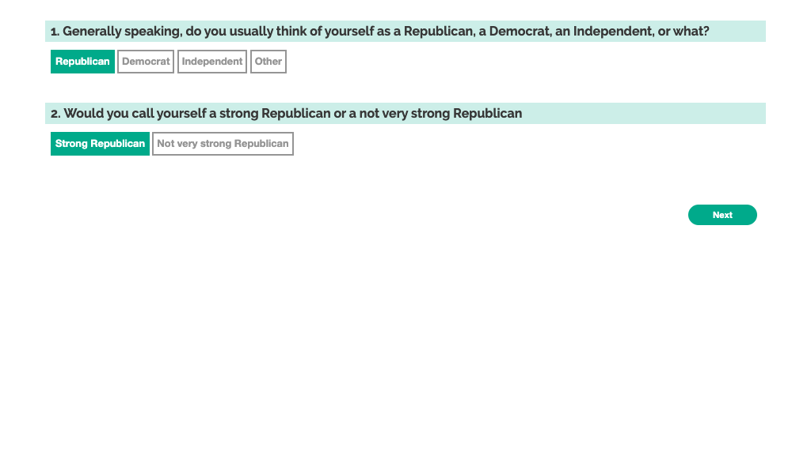

# Political Party US

# Party Identification

From `Van Holsteyn & Galen A. Irwin, Joop J. M. 2017. “Party Identification.” In The SAGE Encyclopedia of Political Behavior, edited by Fathali M. Moghaddam. SAGE Publications, Inc.`

> The operationalization of party identification by Angus Campbell and his colleagues in the 1950s and 1960s has become a staple in the American national election studies. The standard question wording in these stud- ies has been this: _Generally speaking, do you usually think of yourself as a Republican, a Democrat, an In- dependent, or what?_ The phrase think of yourself emphasizes self-identification, while generally and usually indicate the identification with the party should be an enduring one.

> This standard question primarily taps the direction of party identification and a follow-up question is assumed to tap its intensity. For Republican and Democratic identifiers, the follow-up question is, _Would you call yourself a strong (Republican/Democrat) or a not very strong (Republican/Democrat)?_ For Independents, direction and intensity are combined in one ques- tion: Do you think of yourself as closer to the Republican Party or to the Democratic Party? The results of these questions can be combined to form a 7-point unidimensional scale: Strong Republican, Weak Republi- can, Leaning Republican, Independent, Leaning Democrat, Weak Democrat, and Strong Democrat.

These initial questions are implemented verbatim.

## Used in:

- `Druckman, James N., and Matthew S. Levendusky. 2019. “What Do We Measure When We Measure Affective Polarization?” Public Opinion Quarterly 83 (1): 114–22.`

- `Jan G. Voelkel, Michael N. Stagnaro, James Chu, Sophia Pink, Joseph S. Mernyk, Chrystal Redekopp, Matthew Cashman, James N. Druckman, David G. Rand, and Robb Willer. 2021. “Megastudy Identifying Successful Interventions to Strengthen Americans’ Democratic Attitudes,” `

Followup questions are taken from: `Jan G. Voelkel, Michael N. Stagnaro, James Chu, Sophia Pink, Joseph S. Mernyk, Chrystal Redekopp, Matthew Cashman, James N. Druckman, David G. Rand, and Robb Willer. 2021. “Megastudy Identifying Successful Interventions to Strengthen Americans’ Democratic Attitudes,” `

