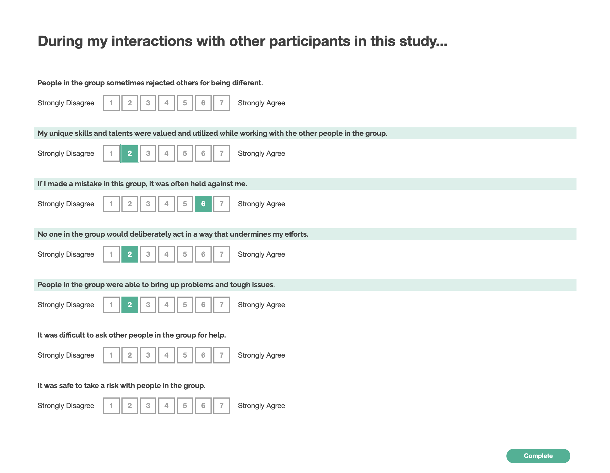

# Psychological Safety

## Theoretical construct

This survey measures a construct of psychologial safety, or the ease with which participants can be vulnerable with one another. The underlying construct was originally proposed in:

Edmondson, Amy. 1999. “Psychological Safety and Learning Behavior in Work Teams.” Administrative Science Quarterly 44 (2): 350–83.

> Team psychological safety is defined as a shared belief that the team is safe for interpersonal risk taking. For the most part, this belief tends to be tacit-taken for granted and not given direct attention either by individuals or by the team as a whole. Although tacit beliefs about interpersonal norms are sometimes explicitly discussed in a team, their being made explicit does not alter the essence of team psychological safety. The construct has roots in early research on organiza- tional change, in which Schein and Bennis (1965) discussed the need to create psychological safety for individuals if they are to feel secure and capable of changing.
>
> Team psychological safety is not the same as group cohesiveness, as research has shown that cohesiveness can reduce willingness to disagree and challenge others' views, such as in the phe- nomenon of groupthink (Janis, 1982), implying a lack of inter- personal risk taking. The term is meant to suggest neither a careless sense of permissiveness, nor an unrelentingly posi- tive affect but, rather, a sense of confidence that the team will not embarrass, reject, or punish someone for speaking up. This confidence stems from mutual respect and trust among team members.

### Original survey instrument:

1. If you make a mistake on this team, it is often held against you.
2. Members of this team are able to bring up problems and tough issues.
3. People on this team sometimes reject others for being different.
4. It is safe to take a risk on this team.
5. It is difficult to ask other members of this team for help.
6. No one on this team would deliberately act in a way that undermines my efforts.
7. Working with members of this team, my unique skills and talents are valued and utilized.

## Adaptations

The study was adapted in:
Adapted in _Nicole Abi-Esber, Alison Wood Brooks, and Ethan Burris. “Feeling Seen: Leader Eye Gaze Promotes Psychological Safety, Participation, and Voice.”_ as:

> 1. During this conversation I felt if I made a mistake, the other people in the group would
>    hold it against me. (R)
> 2. During this conversation I felt the other people in the group were able to bring up
>    problems and tough issues.
> 3. During this conversation I felt the other people in the group sometimes rejected others for being different. (R)
> 4. During this conversation I felt it was safe to take a risk with the other people in the group.
> 5. During this conversation I felt like it was difficult to ask the other players for help. (R)
> 6. During this conversation I felt like no one would deliberately act in a way that
>    undermined me and my efforts.
> 7. During this conversation I felt like my unique skills and talents were valued and utilized while working with the other people in the group.
>
> **(responses ranging from 1= strongly disagree to 7 = strongly agree)**

The "feeling seen" paper makes several adjustments:

1. The language replaces "members of the team" with "people in the group", to generalize to situations in which there isn't really a team (ie, experiments with convened groups that have not formed teams).
2. The questions are put in past tense to refer to what has occurred in the experiment.
3. The focus is shifted to "other people in the group" rather than all members of the team. This may move the focus away from the respondent, although it isn't clear that this was an explicit choice.

The first two adjustments are clearly needed for using in the online experiment context. The the third is a survey design decision. It is valid for a participant's own experience of (e.g.) sharing problems and tough issues to influence their perception of psychological safety in the group. On the other hand, an individual's ability to bring up problems and tough issues is also related to "Voice", a separate construct. On balance, we decided to stick as close to the original language as possible, given adjustments 1 and 2.

This isn't without risk, as it is possible that the adjustments that adapt the survey from an existing group to a convened group are not sufficient. Do people in this context have enough experience with one another to answer about what would happen if you made a mistake? This is a risk we choose to live with for now, but may need to revisit at a later date.

### Questions as implemented:

1. "If you made a mistake in this group, it was often held against you." _(reverse-coded)_
2. "People in the group were able to bring up problems and tough issues."
3. "People in the group sometimes rejected others for being different." _(reverse-coded)_
4. "It was safe to take a risk with people in the group."
5. "It was difficult to ask other people in the group for help." _(reverse-coded)_
6. "No one in the group would deliberately act in a way that undermines my efforts."
7. "My unique skills and talents were valued and utilized while working with the other people in the group."

### Screenshot

