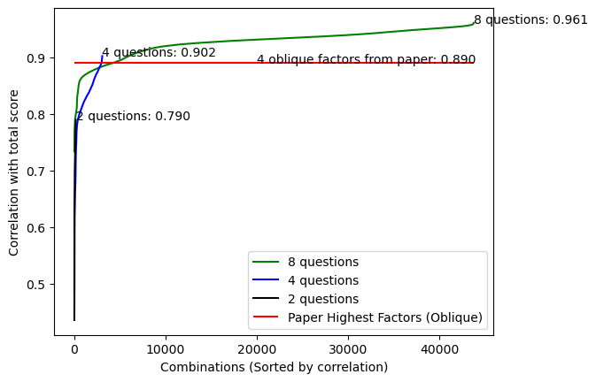

# Four Item Receptiveness to Opposing Views

This survey adapts (Minson, Julia A., Frances S. Chen, and Catherine H. Tinsley. 2020. “Why Won’t You Listen to Me? Measuring Receptiveness to Opposing Views.” Management Science 66 (7): 3069–94.) by reducing the number of questions from 18 to 4.

Our goals in selecting these are to choose questions that taken together yield the highest correlation with the full 18-item scale, while also yielding questions that are sensible, and if possible correspond to the different primary factors listed in the paper.

The obvious way to do this is to just use the questions that have the highest factor loading in the paper. There are two forms of factor analysis reported:

#### Varimax rotation factor analysis

This forces the factors to be orthogonal, and suggests the following questions:

> 1. ' I often get annoyed during discussions with people with views that are very different from mine. (R)'
> 2. ' I like reading well thought-out information and arguments supporting viewpoints opposite to mine.',
> 3. ' People who have views that oppose mine often base their arguments on emotion rather than logic. (R) ',
> 4. ' Some ideas are simply too dangerous to be part of public discourse. (R) '

#### Oblique rotation factor analysis

This allows the factors to be correlated, and is probably what we want to pay attention to for the purpos

> 1. ' I often feel frustrated when I listen to people with social and political views that oppose mine. (R) ',
> 2. ' I like reading well thought-out information and arguments supporting viewpoints opposite to mine.',
> 3. ' People who have views that oppose mine often base their arguments on emotion rather than logic. (R) ',
> 4. ' Some ideas are simply too dangerous to be part of public discourse. (R) '

The two methods are produce the same result for 3 of the 4 factors, and the difference in the remaining factor is in both cases less than 0.4%. As a result, we can choose to use the four factors from the oblique rotation analysis.

## Double-checking this choice

We can double-check that this result is reasonable by comparing the correlation of these four items against the correlation with every other four-item question set. Using the combined dataset for all studies reported in the paper (rather than just the study used to design the scale) gives 16698 rows. The best performing four-item question set gives a correlation of 0.902, while the correlation of the most loaded factors is 0.890, about a 1% difference. As such, we safely defer to the paper's listed highest loaded factors.

We also compare the performance of the 4-item scale to the best performing 2-item scale (correlation 0.790) and 8 itme scale (.961). Using a 4-item version seems to be a reasonable compromise between fidelity and brevity, while still allowing us to extract the component factors.
