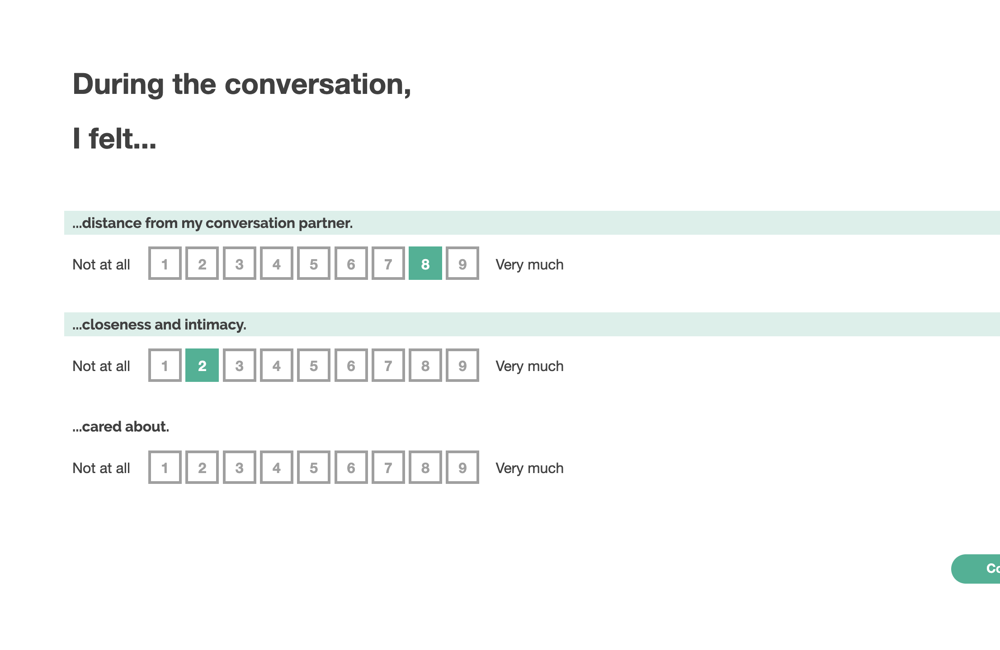

# Survey Purpose

# Expected behavior

# Design and modifications

We used survey items developed by Netta Weinstein and Tia Moin in their work on listening training.

# Literature/Past Project Citations

### Screenshot

