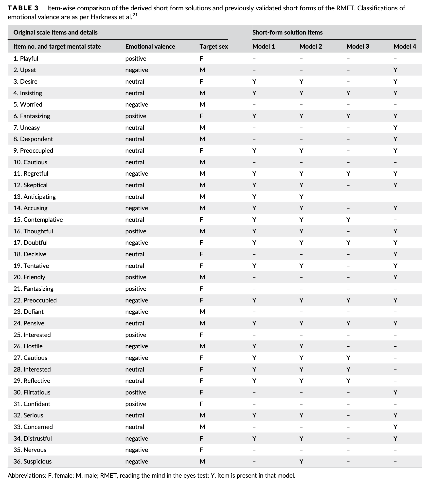

# Reading the Mind in the Eye

This is a ten-item version of the Reading the Mind in the Eyes test.

Items are taken from:

Chander, Russell J., Sarah A. Grainger, John D. Crawford, Karen A. Mather, Katya Numbers, Rhiagh Cleary, Nicole A. Kochan, Henry Brodaty, Julie D. Henry, and Perminder S. Sachdev. 2020. “Development of a Short-Form Version of the Reading the Mind in the Eyes Test for Assessing Theory of Mind in Older Adults.” International Journal of Geriatric Psychiatry 35 (11): 1322–30.

10 item version, in model 3:

