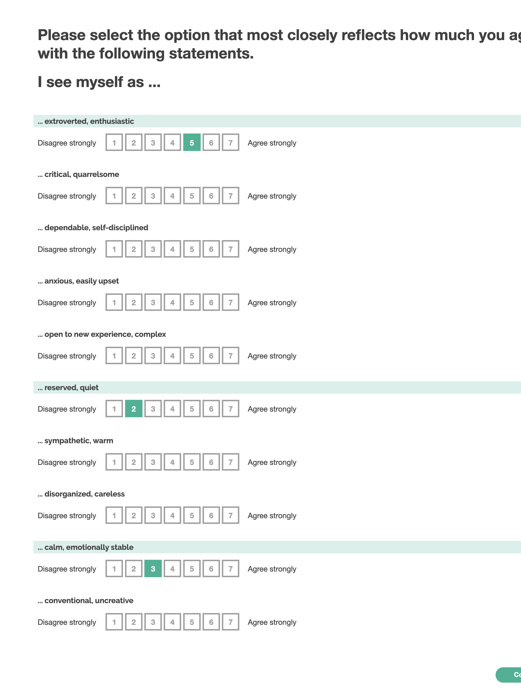

# Survey Purpose

This particular survey aims to use the Ten-Item Personality Inventory (TIPI) to quantify the particpant's Big-Five personality dimensions.

# Expected behavior

We expect that perticipants will thoughtfully complete this survey, selecting the choice for each prompt that most closely reflects their evaluation of their own personality.

# Design Rationale

We used survey items developed by Samuel D Gosling, Peter J Rentfrow, and William B Swann, in their paper on measuring the Big-Five personality domains.

Scores range from 1 (disagree strongly) to 7 (agree strongly)

Samuel D Gosling, Peter J Rentfrow, William B Swann,
A very brief measure of the Big-Five personality domains,
Journal of Research in Personality,
Volume 37, Issue 6,
2003,
Pages 504-528,
ISSN 0092-6566,
https://doi.org/10.1016/S0092-6566(03)00046-1.
(https://www.sciencedirect.com/science/article/pii/S0092656603000461)

### Screenshot

