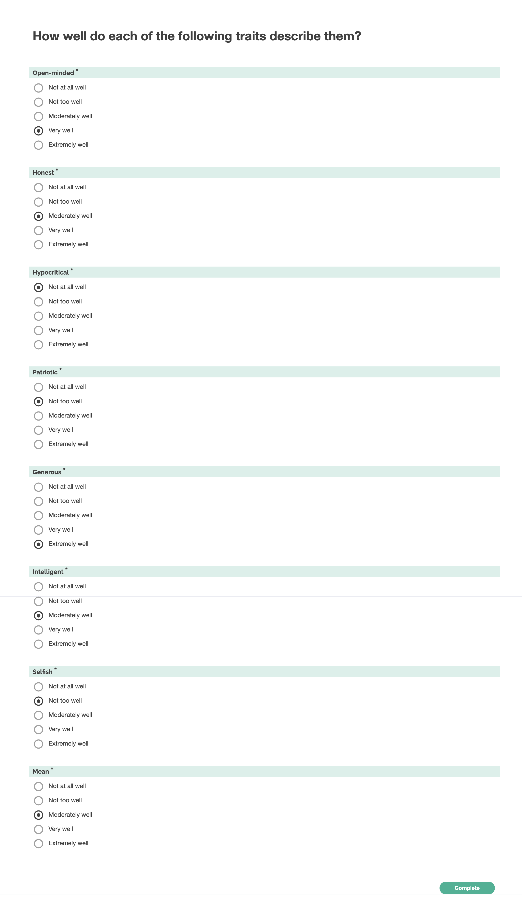

# Trait ratings

Much like "Perceptions of Others" This survey asks about a generic other, "they/them", and could apply to a specific indiviual alter, the group as a whole, or entire groups of people outside the discussion, for example "Republican voters" or "Democratic Politicians".

**It should be preceded with a statement directing the respondent which person(s) they should keep in mind when answering the questions.**

For example:

> We would now like to ask some questions about (the other people in your group / your conversation partner / the person you were negotiating with / the provost / the person you found it most difficult to get along with.)

## Source material

We've chosen to use the traits from the most well-cited source, Druckman and Levendusky 2019. We adapted the introductory language for this context, to allow the survey to be used directly with a prepended description of who the items should apply to. In keeping with our choices in other surveys, we also simplify the language to make the survey easier to read.

> "Below, we’ve given a list of words that some people might use to describe individuals. For each item, please indicate how well you think it applies to $OTHERPARRTY: extremely well, very well, somewhat well, not too well, or not at all well. How well does each of the following apply to $OTHERPARTYs? Patriotic / Intelligent / Honest / Open-minded / Generous / Hypocritical / Selfish / Mean. \* Not at all well / Not too well / Somewhat well / Very well / Extremely well" (Druckman, James N., and Matthew S. Levendusky. 2019. “What Do We Measure When We Measure Affective Polarization?” Public Opinion Quarterly 83 (1): 114–22.)

> ...perceptions of the outparty, which I measure by asking participants to rate, using a five point Likert scale, how well eight traits (i.e., openminded, mean) describe members of the outparty (e.g., Levendusky 2018). Trait ratings were asked in the posttreatment survey only. (Rossiter, Erin. 2023. “The Similar and Distinct Effects of Political and Non-Political Conversation on Affective Polarization.”)

> "We also measured participants’ perceptions of the warmth, open-mindedness, intelligence, reasonableness, objectivity, and morality of typical proponents of the comprehensive exam policy, and created a composite measure of these six items" (Chen, Frances S., Julia A. Minson, and Zakary L. Tormala. 2010. “Tell Me More: The Effects of Expressed Interest on Receptiveness during Dialog.” Journal of Experimental Social Psychology 46 (5): 850–53.)

> "participants had to picture a person that gave opposing answers to the seven political registration questions. We then elicited participants’ beliefs about this person by asking them the extent to which they agree with different statements about the contrary-minded person on a seven-point Likert scale. Importantly, we did not elicit beliefs and attitudes toward the matched partner but some generic person who holds opposing views. We elicited four stereotypes, reflecting the beliefs that contrary-minded persons have low cognitive abilities, are poorly informed, have different moral values and lead a different life. We condense these questions by conducting a PCA. We use the first principal component as our overall stereotype measure. A higher value of our Stereotypes measure is associated with larger stereotypes about contrary-minded individuals. Questions: "Cognitive Abilities: This person is incapable of understanding complex contexts. Poorly Informed: This person is poorly informed. Moral Values This person has completely different moral values. Way of Life This person leads a completely different life." (Fang, Ximeng, Sven Heuser, and Lasse S. Stötzer. 2023. “How In-Person Conversations Shape Political Polarization: Quasi-Experimental Evidence from a Nationwide Initiative.” In Econtribute. https://www.econtribute.de/RePEc/ajk/ajkdps/ECONtribute_270_2023.pdf.)

> "Affective Evaluations: Participants were asked to rate the extent to which nine traits applied to each of the four referents (typical Republican/Democrat, known Republican/Democrat). These nine traits were identical except for the referent targeted. The nine traits were honest, knowledgeable, prejudiced (reverse coded), smart, immoral (reverse coded), humble, open-minded, warm, and selfish (reverse coded). Response options were on a 5-point scale that ranged from 1 (disagree) to 5 (agree), with higher scores reflecting more positive evaluations. These nine traits were combined to form an affective evaluation score for each of the four target groups. (Bond, Robert M., Hillary C. Shulman, and Michael Gilbert. 2018. “Does Having a Political Discussion Help or Hurt Intergroup Perceptions? Drawing Guidance From Social Identity Theory and the Contact Hypothesis.” International Journal of Communication Systems 12 (0): 21.)
